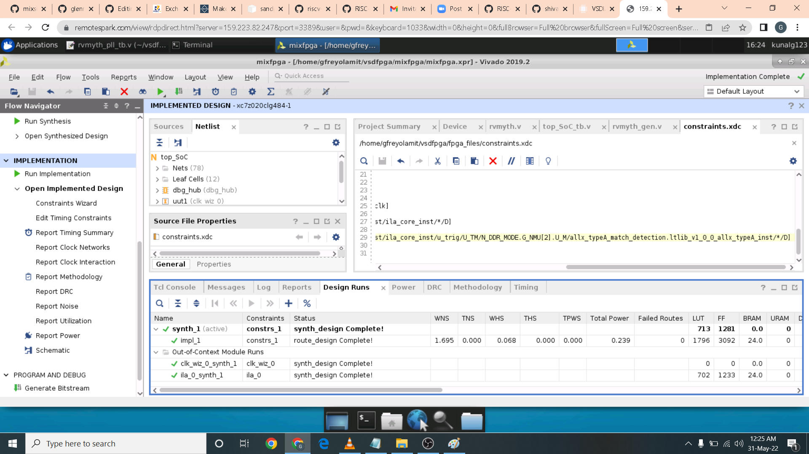

# mixsignalfpga
Mixed Signal SoC (RISC-V based Core + PLL) on FPGA

### ABOUT THE WORKSHOP
Mixed Signal SoC (RISC-V based Core + PLL) on FPGA
### AUTHOR OF THE WORKSHOP
#### Shivani Shah
#### Mr. Kunal Ghosh
Co-founder of VLSI System Design (VSD) Corporation Private Limited
#### Mr. Steve Hoover
Founder of RedwoodEDA Inc.
### AGENDA
 [Day 1 : ](#Day1)
  * [L1 - Introduction](#L1-Introduction)
  * [L2 - RVMYTH RISC-V Core](#L2-RVMYTH-RISC-V-Core)
  * [L3 - TL Verilog](#L3-TL-Verilog)
  * [L4 Why FPGAs?](#L4-Why-FPGAs?)
  * [L5 - Makerchip](#L5-Makerchip)
  * [L6 - TLV to RTL](#L6-TLV-to-RTL)
  * [L7 - iverilog Simulation](#L7-iverilog-Simulation)
  * [L8 - FPGA - Steps To Create project](#L8-FPGA-Steps-To-Create-project)
  * [L9 - FPGA - Steps To Generate IPs](#L9-FPGA-Steps-To-Generate-IPs)
  * [L10 - FPGA - RTL Simulation](#L10-FPGA-RTL-Simulation)
  * [L11 - FPGA - Synthesis](#L11-FPGA-Synthesis)
  * [L12 - FPGA - Implementation And Timing Analysis](#L12-FPGA-Implementation-And-Timing-Analysis)
  * [L13 - FPGA - Bit Stream Generation FPGA Programming And ILA](#L13-FPGA-Bit-Stream-Generation-FPGA-Programming-And-ILA)
  * [Acknowledgement](#Acknowledgement)
## L1 Introduction 

## L2 RVMYTH RISC-V Core
## L3 TL Verilog
## L4 Why FPGAs?
## L5 Makerchip
## L6 TLV to RTL

## L7 iverilog Simulation

## L8 FPGA Steps To Create project Block Design
FPGA Implementation: Block Design
Step 1: Create the project with Zedboard as board option

Step 2: Add rvmyth.v, clk_gate.v and top_SoC.v as design resources
Here I add the rvmyth.v and clk_gate.v files

Here I add to top_SoC.v file as design resource

The header for rvmyth are automatically fetch as shown

## L9 FPGA Steps To Generate IPs
FPGA Implementation: RTL Simulation
Step 3: Generate PLL and ILA IPs from Xilinx IP Catalog
Here I add the PLL IP using Xilinx IP Catalog. As shown a window wizard pop up.

Here I configured the PLL to required Settings

Next is the Integrated Logic Analyzer IP is used and configured

Step 4: Add top_SoC_tb.v as simulation source
I then upload the testbench as required for the simulation.

## L10 FPGA RTL Simulation
Step 5: Run behavioral simulatioin and verify the funtionality
Here I run the simulation as shown.

I then measure the frequency by marking the rising edge of consecuted cycle for each signal. Here the clock signal and the pll clock.

The output DAC signal of RISC-V can be viewed in analog as shown.
Step 6: Add constraints.xdc as a constraints source

Constrain file use in this lab are shown above.
## L11 FPGA Synthesis
Step 7: Run Synthesis

## L12 FPGA Implementation And Timing Analysis
FPGA Implementation (PNR) & STA
Step 8: Run Implementation
Here I run the simulation after synthesis is completed and get error report as shown. 

Step 9: Check for setup and hold violations if any 
I then check for the violations report in the timing tab below as shown. 

Here we have a hold violations with corresponding instance of connections.

Here I edit the constraints to ignore the signals generated in these connections.

After editing the constraints file I run the synthesis and implementation again. 

And finally here I get red of hold violations.

## L13 FPGA Bit Stream Generation FPGA Programming And ILA
Step 10: Generate the bitsteam and program FPGA
After the implementation is completed I generate the bitstream by pressing the bitstream button

The Bitstream is complete. Now we need to connect the board so we can program the fpga board. The OpenManager automatically connects to the board if you press the autoconnect button.

Since I do not have a board connected as of the moment I get these response as shown.

## Acknowlodgement
- Shivani Shah
- Kunal Ghosh, Co-founder, VSD Corp. Pvt. Ltd.
- Steve Hoover, Founder, Redwood EDA

